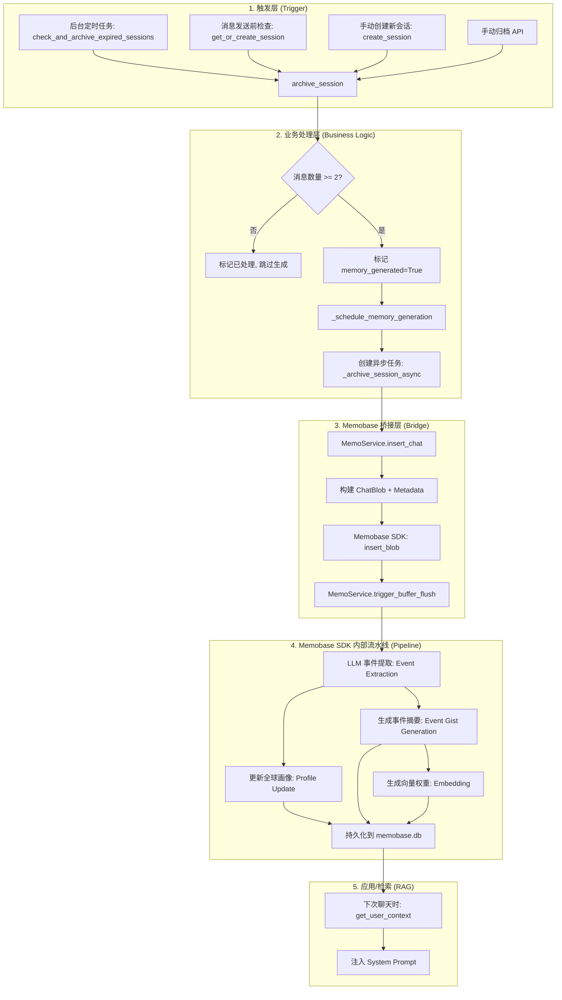

# Memobase 记忆保存流程梳理

本文档梳理了 WeAgentChat 中集成 Memobase SDK 后，记忆生成的完整生命周期，包括触发机制、数据流转以及 Memobase 内部的处理逻辑。

## 1. 流程图 (Mermaid)

## 2. 核心步骤详述

### 1. 触发 (Trigger)
会话不会在每条消息发送后立即产生记忆，而是遵循 **"Passive Session" (被动会话)** 逻辑：
*   **超时触发**：如果用户停止交流超过 30 分钟（默认值，可在设置中修改），系统认为该会话已结束。
*   **强制触发**：当用户手动开启针对同一好友的新会话时，系统会先强制归档旧会有。
*   **并发保护**：只有 `msg_count >= 2` 的会话才会被处理，避免空会话或单条问候语污染记忆。

### 2. 调度 (Scheduling)
在 `archive_session` 中，会话被标记为 `memory_generated = True`，然后通过 `_schedule_memory_generation` 进入异步处理。
*   如果当前存在运行中的 `asyncio` 事件循环，会直接创建一个 `_archive_session_async` 任务。
*   数据包括：会话历史（OpenAI 格式）、好友 ID、好友名称、归档时间。

### 3. 数据持久化与桥接 (Ingestion)
通过 `MemoService` (位于 `app/services/memo/bridge.py`)：
1.  **确保用户存在**：调用 `ensure_user` 初始化 Memobase 侧的用户 ID。
2.  **插入 Blob**：将对话记录包装成 `ChatBlob`，并附加 `friend_id` 等扩展字段（用于后续过滤检索）。
3.  **强制刷新**：为了让记忆在界面上能够尽快出现（或方便测试），业务逻辑调用了 `trigger_buffer_flush`，这会绕过系统的 60s 定时检查，立即开始 LLM 处理。

### 4. Memobase 内部处理 (SDK Pipeline)
这是最核心的 AI 处理环节：
*   **事件提取 (Event Extraction)**：使用 LLM 根据预设的 YAML 配置，从原始对话中提取具有语义价值的 "事件"。
*   **画像更新 (Profile Update)**：如果是关于用户偏好、身份、重要生平的信息，会更新到 User Profile。
*   **摘要生成 (Gist Generation)**：为提取的每个事件生成简短的描述（Gist），便于人类阅读和向量检索。
*   **向量化 (Embedding)**：对 Gist 进行 Embedding，存储到支持向量搜索的 `memobase.db` 中。

## 3. 核心文件参考

*   **业务逻辑触发**：`server/app/services/chat_service.py`
*   **SDK 桥接代码**：`server/app/services/memo/bridge.py`
*   **SDK 实现**：`server/app/vendor/memobase_server/`
*   **数据库存储**：
    *   主库：`server/data/doudou.db` (存储 `ChatSession.memory_generated` 状态)
    *   记忆库：`server/data/memobase.db` (存储 Profile, Event, Gist, Vector)
